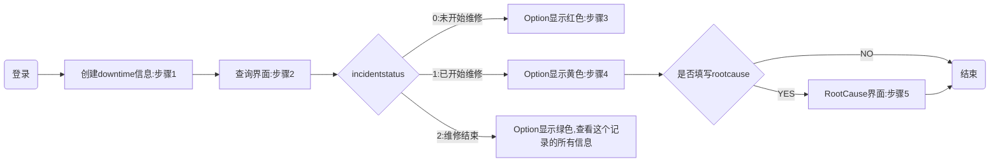

## Downtime System

### Function
**incidentstatus:**
> 0：录入系统
> 1：开始修
> 2：维修结束

**actionstatus:**
> 0：没有动作
> 1：开始修
> 2：修结束
> 3：填写完rootcause

**默认维修人员和填写rootcause的是同一个人**

- [ ] 1、Dashboard （暂时不开发）
> 根据Project筛选出 最近50条downtime历史记录（分两页，每页25条），根据incidentstatus显示不同的颜色
> 报警灯提示，每条报警产生后显示红灯，技术员录入工号后表示开始维修显示黄灯、维修结束后点击结束按钮显示绿灯
- [x] 2、 Log in
>绑定公司NTID 登录，获取用户名等信息，方便在后续使用
- [ ] 3、步骤1：创建downtime信息

|参数|内容|
|----|----|
|comefrom | Downtime System （系统输入） |
|alarmtype | Downtime （系统输入） |
|project | （可选） |
|line | （可选） |
|station | （可选） |
|urgentlevel（报警等级）|1/2/3(可选，可不填)|
|occurtime|	downtime开始时间(默认当前时间，可自定义)|
|calcdowntime(false,true)|（系统输入） 	默认true|
|department	|（可选）|
|issue| 故障类型(可选) （产线提供）|
|issueremark|故障描述|
|creator|Link  NTID 登录（系统输入） |

- [x] 4、步骤2：查询所有downtime记录，按状态和创建时间的倒叙排列

- [x] 5、步骤3：开始维修 (展示步骤一的信息，修改数据库中下列信息)，手动输入工号开始维修

|参数|内容|
|----|----|
|incidentstatus(int) |（系统输入）  1|
|actionstatus(int)|（系统输入）  1|
|respperson(维修人员) | Link  NTID 登录（手动输入：工号（W0000）） |
|repairtime(开始维修的时间) | 当前时间（系统输入） |

- [x] 6、步骤4：维修结束，该步骤只显示一个按钮，点击后可选择是否填写rootcause(步骤5)

|参数|内容|
|----|----|
|finishtime | 当前时间（系统输入） |
|downtime | （系统输入） 计算方式：fininshtime - occurtime(second) |
|incidentstatus(int) |（系统输入） 2|
|actionstatus(int)|（系统输入）  2|

- [x] 7、步骤5：填写检修报告
>当calcdowntime：true时，显示 starttime,finishtime 和 downtime数据

|参数|内容|
|----|----|
|calcdowntime(false,true) | 判断是否计入downtime（用户自选）（不计入：false；计入：true）,不计入downtime的downtime时间显示为"NULL"|
|labor(int)(影响到的人数)|可修改（整数个）|
|actionstatus(int)|（系统输入）  3|
|rootcause|自己输入（后期改成选择项）|
|rootcauseRemark|自己输入|
|action|自己输入（后期改成选择项）|
|actionRemark|自己输入|

- [x] 8、Downtime报告导出

