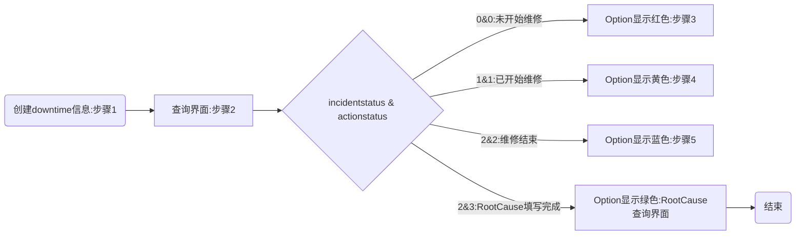

# Downtime System

## Function

**incidentstatus:**
> 0：录入系统
> 1：开始修
> 2：维修结束

**actionstatus:**
> 0：没有动作
> 1：开始修
> 2：修结束
> 3：填写完rootcause

- [x]  ~~Log in~~

>绑定公司NTID 登录，获取用户名等信息，方便在后续使用

- [x] 步骤1：创建downtime信息

|参数|内容|
|----|----|
|comefrom | Downtime System （系统输入） |
|alarmtype | Downtime （系统输入） |
|project | （可选） |
|line | （可选） |
|station | （可选） |
|urgentlevel（报警等级）|1/2/3(可选，可不填)|
|occurtime|downtime开始时间(默认当前时间，可自定义)|
|calcdowntime(false,true)|（系统输入） 默认true|
|department|（可选）|
|issue| 故障类型(可选) （产线提供）|
|issueremark|故障描述|
|creator|Link  NTID 登录（系统输入） |

- [x] 步骤2：查询所有downtime记录，按状态和创建时间的倒叙排列

- [x] 步骤3：开始维修 (展示步骤一的信息，修改数据库中下列信息)，手动输入工号开始维修

|参数|内容|
|----|----|
|incidentstatus(int) |（系统输入）  1|
|actionstatus(int)|（系统输入）  1|
|respperson(维修人员) | Link  NTID 登录（手动输入：工号（W0000）） |
|repairtime(开始维修的时间) | 当前时间（系统输入） |

- [x] 步骤4：维修结束，该步骤只显示一个按钮，点击后可选择是否填写rootcause(步骤5)

|参数|内容|
|----|----|
|finishtime | 当前时间（系统输入） |
|downtime | （系统输入） 计算方式：fininshtime - occurtime(second) |
|incidentstatus(int) |（系统输入） 2|
|actionstatus(int)|（系统输入）  2|

**默认维修人员和填写rootcause的是同一个人**

- [x] 步骤5：填写检修报告

>当calcdowntime：true时，显示 starttime,finishtime 和 downtime数据

|参数|内容|
|----|----|
|calcdowntime(false,true) | 判断是否计入downtime（用户自选）（不计入：false；计入：true）,不计入downtime的downtime时间显示为"NULL"|
|labor(int)(影响到的人数)|可修改（整数个）|
|actionstatus(int)|（系统输入）  3|
|rootcause|自己输入（后期改成选择项）|
|rootcauseRemark|自己输入|
|action|自己输入（后期改成选择项）|
|actionRemark|自己输入|

- [x] Downtime报告导出

### Debug and Modify

#### 2022.03.14 Justin Demand

- Downtime System 和Action Tracker的区别

>Downtime System：储存所有downtime信息
Action Traker：记录所有系统发出来的事件，并对其经行分析，和学习总结

Dashboard设计要求

- [ ] 只获取计算downtime的，来自E-Calling,Sparepart,FPY,Downtime系统自身的数据

> 暂无数据

- [x] **计算30天内的数据**
- [x] Top 5 error code with station/line/equipment  

> 前五项 error code(按次数),每个station占多少个->line占多少个->equipment占多少个(数据库不记录equipment信息)
> 1、查询前五项error code:SELECT issue,count(issue) as quantity from public.incident_det group by issue order by quantity desc limit 5

- [x] Top 5 root cause with per downtime defect code

> 前五项 rootcause (按downtime)，每个 error code 各占多少时间（不显示占时少于5min的error code）

- [x] Top 5 downtime with machine/station category

> 前五项 error code(按downtime),每个系统各占多少时间

- [x] Total downtime per functionalteam

> 前五项 error code(按downtime),每个部门各占多少时间

- 下一阶段设计
- [ ]  Downtime corrective actions & failure analysis experience collection

> 根据Project筛选出 最近50条downtime历史记录（分两页，每页25条），根据incidentstatus显示不同的颜色
> 报警灯提示，每条报警产生后显示红灯，技术员录入工号后表示开始维修显示黄灯、维修结束后点击结束按钮显示绿灯###

#### 2022.03.17 Demand

- [x] add filter for project and time zone
- [x] Chart1:Add information of rootcause
- [x] Chart2:downtime open & close QTY,click function->Show downtime incident list
- [x] downtime calculate in hours

#### 2022.03.22 Update

- [x] 数据库增加 machine 属性，web 做相应的调整

#### 2022.03.30 Demand

- [ ] ~~调整dashboard位置：station,department,open&close,errorcode~~
- [x] Dashboard增加 system filter 和 department filter

> open & close table增加表头筛选功能

- [x] 增加当前时间显示
- [x] Downtime Task界面的弹窗可自动消失，减少人员的点击操作
- [x] Debug:修复Dashboard不显示当天数据的问题
- [x] Open&Close Detail information时间统一为小时

#### 2022.03.31 Update

- [x] 增加system filter
- [x] Dashboard增加 department filter
- [x] Chart1根据内容显示title
- [ ] ~~小时显示小数位~~

#### 2022.04.29 Demand

**有其他需求,需求待整合**

- [ ] Sparepart具体的界面内容待确定 
- [x] Sparepart数据，单独列出来，不显示在Downtime Dashboard中
- [x] Downtime初始数据可维护:在填写 RC/CA 阶段维护 station,machine,defect code 和 issue description 信息

- [x] Downtime item增加索引和根据索引查询的功能
- [x] Dashboard 不区分 system
- [x] Dashboard 增加固定时区选择功能（周、月/current、last）
- [x] Dashboard Chart2 下层报表增加 Defect Code 和 station 的时间占比图（Pie）
- [x] Dashbaord Chart1 取消逐层钻取，下层报表显示被选则的 Defect Code 的 Line,Station, RootCause top 5
- [x] Dashboard Chart4 改为层叠图，层叠对象为 Downtime Incident 状态
- [x] 一些内容的英文表述需要修改
- [x] 在Dashboard页面上面，增加全屏的按键，
- [x] 页面刷新的间隔时间，例如5分钟、10分钟、30分钟

|错误描述|修正|
|---|---|
|None Rootcause|No FA/CA|
|Issue/Error Code|Defect Code|
|Close|Closed|
|OnGoing|On-going|

#### 2022.05.05 Debug

- [ ] ~~关闭downtime Incident时没有检查当前关闭的人是否是本人~~

#### 2022.05.10 Demand

- [ ] Dashboard Chart1 钻取的图表（line,station,rootcause）用不同的颜色表示
- [x] 刷新时间不可为负

#### 2022.06.09 Demand

- [ ] 每周发送本月的downtime情况，给各FM

#### 2022.06.22 Update

- [X] excel导出增加限制,只导出当前页面的内容,导出条数最多500条数据。
- [X] Troubleshooting Guide问题分析导航(参考e-DMS)

#### 2022.08.18 Update

- [x] Dashboard 增加自定义时间

#### 2022.10.13 Update

- [x] 获取本机登录信息
- [x] Dashboard 初始默认选择今天的downtime
- [x] MTTR: Mean time to repaire (group by customer,department,person)
MTTR (mins) = SUM(Close - Start) / downtime Count
- [x] MTBF: Mean time between fail
 MTBF (mins) = (downtime B endtime -  downtime A starttime)/Total downtime Count
- [x] 员工的平均维修时间（折线图）和维修次数（柱状图）
- [x] 根据员工的 employeeID 筛选出对应的 downtime 事件   

#### 2023.02.14 Demand

- [x] PowerBi Dashboard1：by project-department-station 每天的 的 machine DT 比较图，设置 target，total工作时间（12小时）
- [x] Dashboard2：每天 total Downtime 各 error message 的分布，设置 target，total工作时间（12小时）
- [x] Dashboard3：每天 by machine 的 Total DT,Count，MTTR （？？？？有问题：MTTR计算是 by machine /图像试 By Station 的 ）
- [x] Dashboard4：按 Error Message 统计 total downtime 时间的柏拉图